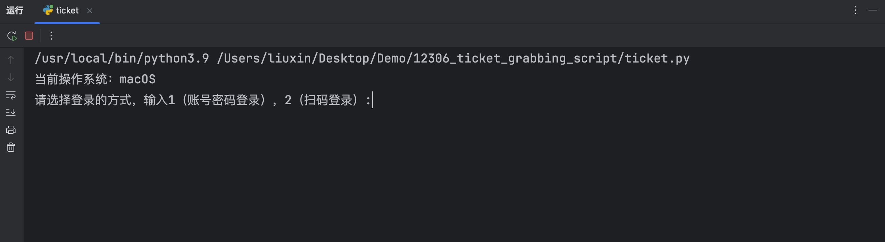

# 12306抢票脚本
python使用selenium实现12306抢票脚本

### 前期环境搭建

Python版本：3.9+

Selenium版本：4.31+

谷歌浏览器驱动chromedriver（需区分Windows/Mac）：下载地址

克隆项目代码：

```shell
git clone https://github.com/cherishlx98/12306_ticket_grabbing_script.git
```

### 配置文件

在运行项目之前，找到项目目录下的settings.txt文件，按照自身12306账号情况进行修改

```
username=12306登录账号（用户名/邮箱/手机号）
password=12306密码
last4=身份证最后4位（如：0031）
fromStationText=出发地（如：永川东）
toStationText=目的地（如：重庆）
train_date=出发日（如：2025-08-08）
passenger_type=乘客类型（只有普通和学生，如：普通）
```

### 运行项目

在pycharm中运行ticket.py



输入1 or 2（以2为例）


进入12306APP，扫码登录，然后再控制台按下回车键继续


进入到12306个人中心页面


稍做等待，进入到车票预订页面，程序将会自动选择我们之前填写的配置信息，然后自动点击查询按钮，车票信息列表如下：


之后会预订我们查询到的第一条车票，车票预订页面如下：


将会自动预订车票


PS：如果一天之内取消订单次数过多（超过3次），将会被取消预订机会😭（明天再来吧～）


抢票完成后，我们需要在指定时间内到12306网页端或移动端完成支付操作，超时未完成支付将会被自动取消订单哦！


后面给出博客地址和B站链接，不需要在github上讲实现过程

## 1.实现登录逻辑

1️⃣获取浏览器驱动


## 2.实现预订座位


## 3.实现支付提醒

## 4.后记
